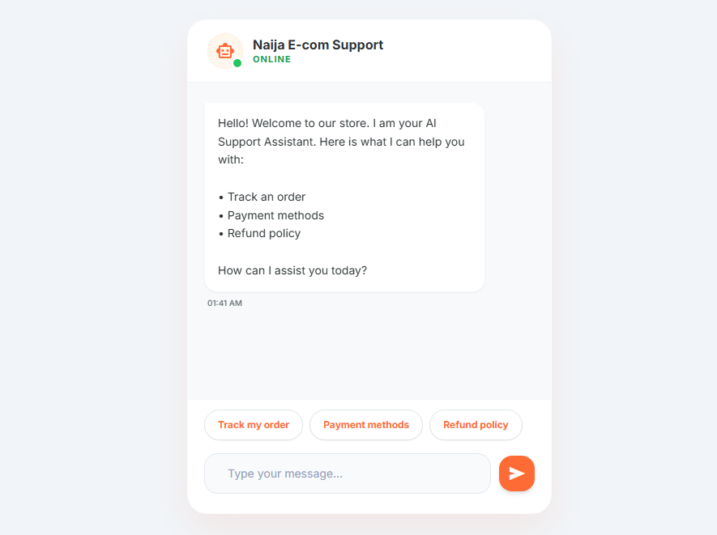

# Naija E-com Support — AI Customer Service Chatbot

> A neural network-powered customer service chatbot for Nigerian e-commerce, trained on intent classification to handle order tracking, payments, refunds, and general support queries.

[](https://naija-support-bot.onrender.com)
[](./LICENSE)
[](https://python.org)
[](https://tensorflow.org)

---

## 🔗 Live Demo

**[naija-support-bot.onrender.com](https://naija-support-bot.onrender.com)**

> Hosted on Render (free tier — may take 30–60 seconds to wake up on first load)

---

## 📸 Screenshots

<!-- Add screenshots here by dragging images into the GitHub editor -->
| Chat Interface |
|---|
|  |

---

## About

Naija E-com Support is a Flask-based AI chatbot trained on a custom intent classification dataset for Nigerian e-commerce customer service. It uses a Keras sequential neural network with a TF-IDF vectorizer to understand and respond to user queries about order tracking, payment methods, refund policies, delivery timelines, and general store support — all in a clean, mobile-friendly chat UI.

---

## Features

- 🧠 **Neural Network Intent Classification** — Keras sequential model trained on custom e-commerce intents
- 📦 **Order Tracking Support** — Handles order status, delivery timeline, and shipping queries
- 💳 **Payment & Refund Handling** — Responds to payment method and refund policy questions
- ⚡ **Quick Reply Buttons** — Pre-built prompt chips for common customer questions
- 🌐 **Flask Web Interface** — Clean, responsive chat UI served via Python/Flask
- 💾 **Conversation Logging** — SQLite database for storing chat history
- 🔁 **Retrainable** — Full training pipeline included via `train.py`

---

## Tech Stack

| Layer | Technology |
|---|---|
| ML Framework | TensorFlow / Keras |
| NLP | TF-IDF Vectorizer (scikit-learn) |
| Backend | Python, Flask |
| Database | SQLite |
| Training Data | Custom `intents.json` (intent/pattern/response format) |
| Deployment | Render |

---

## Model Architecture

The chatbot uses a supervised intent classification approach:

1. **Input** — User message tokenized and vectorized using TF-IDF
2. **Model** — Keras sequential neural network (Dense layers + Dropout + Softmax output)
3. **Output** — Predicted intent class → mapped to a response from `intents.json`
4. **Training** — Run `train.py` to retrain on updated intents; outputs `chatbot_model.keras`, `vectorizer.pkl`, and `label_encoder.pkl`

---

## Getting Started (Local)

### Prerequisites

- Python 3.8+
- pip

### 1. Clone the repo

```bash
git clone https://github.com/Engrojkeh/ai-chatbot.git
cd ai-chatbot
```

### 2. Install dependencies

```bash
pip install -r requirements.txt
```

### 3. (Optional) Retrain the model

```bash
python train.py
```

This regenerates `chatbot_model.keras`, `vectorizer.pkl`, and `label_encoder.pkl` from `intents.json`.

### 4. Run the app

```bash
python app.py
```

Visit `http://localhost:5000` in your browser.

---

## Adding New Intents

Edit `intents.json` to add new conversation patterns:

```json
{
  "tag": "order_status",
  "patterns": ["Where is my order?", "Track my package", "Order status"],
  "responses": ["Please provide your order ID and we'll check the status for you."]
}
```

Then retrain with `python train.py`.

---

## Project Structure

```
ai-chatbot/
├── static/                 # CSS, JS, frontend assets
├── app.py                  # Flask app — routes and chat logic
├── train.py                # Model training script
├── database.py             # SQLite chat history logging
├── intents.json            # Training data — intent/pattern/response definitions
├── chatbot_model.keras     # Trained Keras model
├── vectorizer.pkl          # Fitted TF-IDF vectorizer
├── label_encoder.pkl       # Intent label encoder
├── requirements.txt        # Python dependencies
├── build.sh                # Render deployment build script
└── .gitignore
```

---

## License

This project is licensed under the [MIT License](./LICENSE).

---

## Author

**Engrojkeh** · [GitHub](https://github.com/Engrojkeh) · [Live Bot](https://naija-support-bot.onrender.com)
